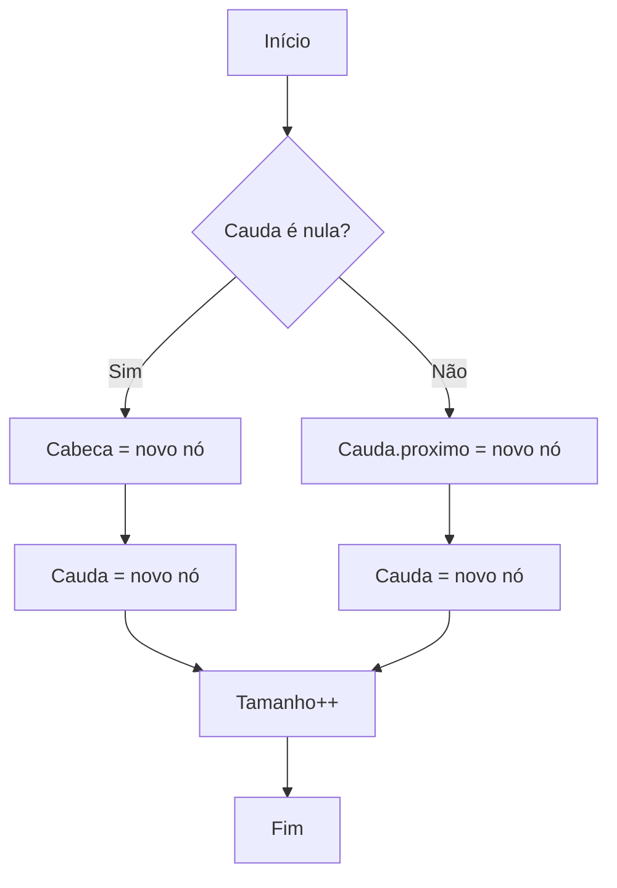
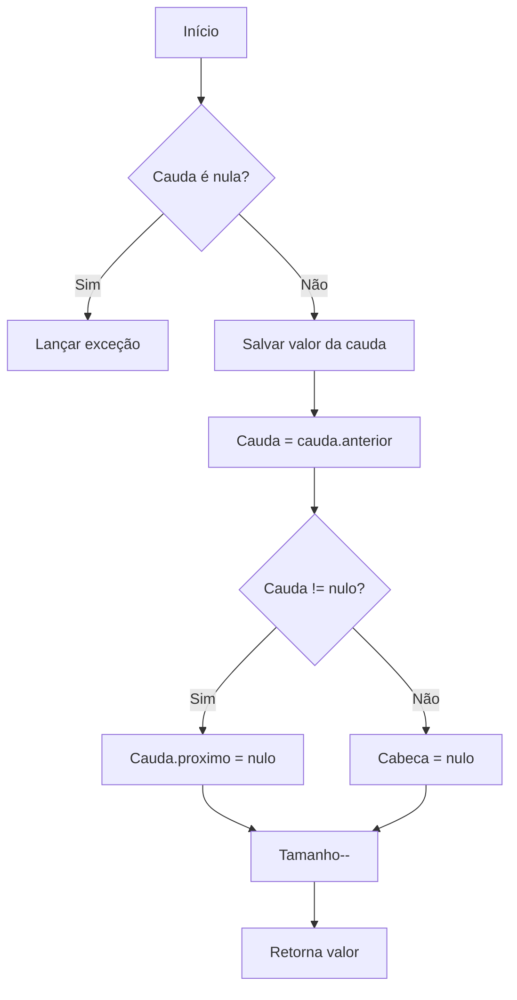
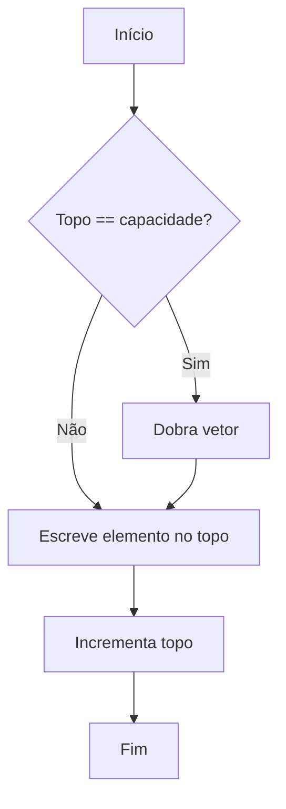
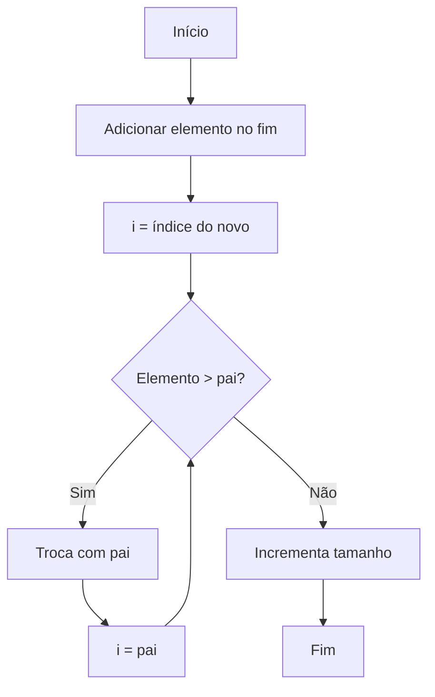
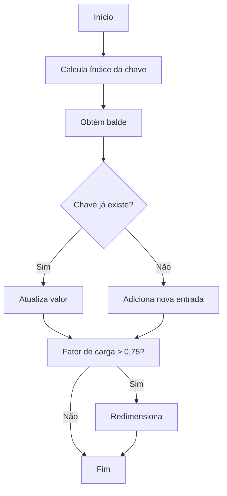
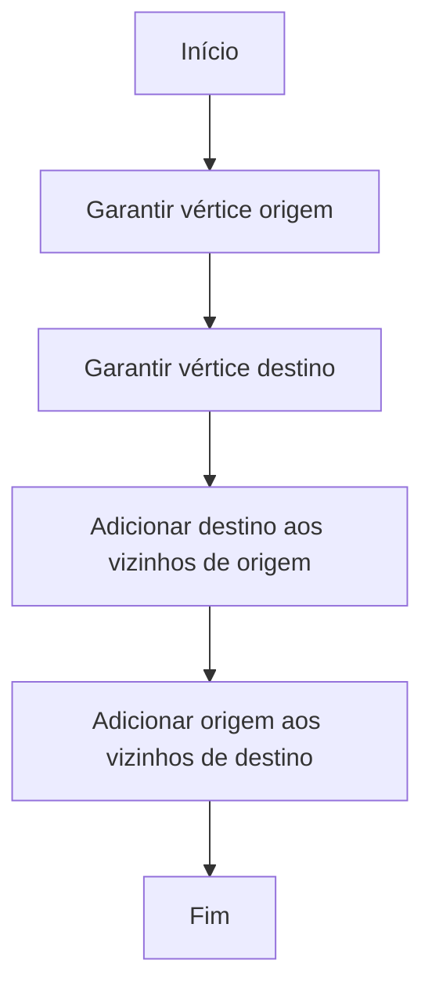

# Estruturas de Dados Disponíveis

Este repositório contém implementações introdutórias de estruturas de dados em Java. A seguir está a documentação completa de cada estrutura presente, com explicações detalhadas, pseudocódigo, implementação em Java e um fluxograma em Mermaid.

## Vetor (Array Dinâmico Simples)

### Conceito e Características

Um vetor é uma coleção ordenada de elementos armazenados em posições contíguas de memória. Nesta implementação, os elementos são strings. As principais características do vetor presente no repositório são:

- **Capacidade fixa inicial**: o tamanho máximo é definido no construtor.
- **Armazenamento contíguo**: permite acesso direto por índice, embora o código disponibilize somente inserção sequencial.
- **Controle de tamanho lógico**: uma variável `tamanho` acompanha quantos elementos foram inseridos de fato.

### Operações Disponíveis

1. **Construtor**: cria o array interno (`elementos`) e define `tamanho = 0`.
2. **Adicionar elemento**: insere o elemento ao final do vetor, caso ainda haja espaço, e incrementa `tamanho`.
3. **Obter tamanho lógico**: retorna quantos elementos foram efetivamente adicionados.
4. **Representação textual**: monta uma string com os elementos já armazenados.

Essas operações estão implementadas em [`src/main/java/com/lucas/estruturadados/vetor/Vetor.java`](../src/main/java/com/lucas/estruturadados/vetor/Vetor.java). 【F:src/main/java/com/lucas/estruturadados/vetor/Vetor.java†L1-L56】

### Pseudocódigo

```text
estrutura Vetor
    dados: array de String
    tamanho: inteiro

função criar(capacidade)
    dados <- novo array de String com comprimento capacidade
    tamanho <- 0
    retornar (dados, tamanho)

função adiciona(vetor, elemento)
    se vetor.tamanho < comprimento(vetor.dados) então
        vetor.dados[vetor.tamanho] <- elemento
        vetor.tamanho <- vetor.tamanho + 1
        retornar verdadeiro
    senão
        retornar falso

função getTamanho(vetor)
    retornar vetor.tamanho

função paraString(vetor)
    texto <- "["
    para i de 0 até vetor.tamanho - 2 faça
        texto <- texto + vetor.dados[i] + ", "
    se vetor.tamanho > 0 então
        texto <- texto + vetor.dados[vetor.tamanho - 1]
    texto <- texto + "]"
    retornar texto
```

### Implementação em Java

```java
package com.lucas.estruturadados.vetor;

public class Vetor {
    private String[] elementos;
    private int tamanho;

    public Vetor(int capacidade) {
        this.elementos = new String[capacidade];
        this.tamanho = 0;
    }

    public boolean adiciona(String elemento) {
        if (this.tamanho < this.elementos.length) {
            this.elementos[this.tamanho] = elemento;
            this.tamanho++;
            return true;
        }
        return false;
    }

    public int getTamanho() {
        return this.tamanho;
    }

    @Override
    public String toString() {
        StringBuilder builder = new StringBuilder();
        builder.append("[");
        for (int i = 0; i < this.tamanho - 1; i++) {
            builder.append(this.elementos[i]);
            builder.append(", ");
        }
        if (this.tamanho > 0) {
            builder.append(this.elementos[this.tamanho - 1]);
        }
        builder.append("]");
        return builder.toString();
    }
}
```

### Fluxograma (Mermaid)

O fluxograma abaixo descreve a lógica da operação de inserção (`adiciona`).

```mermaid
flowchart TD
    A[Início] --> B{Tamanho < Capacidade?}
    B -- Não --> C[Retorna falso]
    B -- Sim --> D[Atribui elemento em elementos[tamanho]]
    D --> E[Incrementa tamanho]
    E --> F[Retorna verdadeiro]
```

### Exemplos de Uso

Os exemplos de utilização estão localizados em [`src/main/java/com/lucas/estruturadados/testes/Aula03.java`](../src/main/java/com/lucas/estruturadados/testes/Aula03.java) e [`Aula04.java`](../src/main/java/com/lucas/estruturadados/testes/Aula04.java), onde é possível observar a tentativa de inserir além da capacidade e a impressão do vetor. 【F:src/main/java/com/lucas/estruturadados/testes/Aula03.java†L1-L13】【F:src/main/java/com/lucas/estruturadados/testes/Aula04.java†L1-L17】

## Lista Encadeada Simples

### Conceito e Características

Uma lista simplesmente encadeada é formada por nós que armazenam um valor e a referência para o próximo nó. Permite inserções e remoções eficientes nas extremidades sem necessidade de deslocar elementos. A implementação usa ponteiros explícitos (`cabeca` e `cauda`) para otimizar inserções no final.【F:src/main/java/com/lucas/estruturadados/lista/encadeada/ListaEncadeada.java†L1-L108】

### Operações Disponíveis

1. **Adicionar no início**: atualiza a cabeça e, se necessário, a cauda.
2. **Adicionar no fim**: usa a referência da cauda para anexar o novo nó rapidamente.
3. **Remover primeiro**: descarta a cabeça e atualiza a cauda quando necessário.
4. **Remover elemento específico**: percorre a lista mantendo referência ao nó anterior.
5. **Consulta**: verificação de presença, tamanho e iterador para varredura.

### Pseudocódigo

```text
estrutura No
    valor
    proximo

estrutura ListaEncadeada
    cabeca
    cauda
    tamanho

procedimento adicionarUltimo(lista, elemento)
    novo <- No(elemento)
    se lista.cauda = nulo então
        lista.cabeca <- novo
        lista.cauda <- novo
    senão
        lista.cauda.proximo <- novo
        lista.cauda <- novo
    lista.tamanho <- lista.tamanho + 1
```

### Implementação em Java

```java
public void adicionarUltimo(T elemento) {
    No<T> novo = new No<>(elemento);
    if (this.cauda == null) {
        this.cabeca = novo;
        this.cauda = novo;
    } else {
        this.cauda.proximo = novo;
        this.cauda = novo;
    }
    this.tamanho++;
}
```

### Fluxograma (Mermaid)



## Lista Duplamente Encadeada

### Conceito e Características

Listas duplamente encadeadas mantêm referências tanto para o próximo quanto para o anterior, permitindo percorrimento em ambas direções e remoções eficientes nas extremidades. A implementação acompanha ponteiros para cabeça e cauda.【F:src/main/java/com/lucas/estruturadados/lista/dupla/ListaDuplamenteEncadeada.java†L1-L96】

### Operações Disponíveis

1. **Inserção no início ou fim**: atualiza ponteiros `anterior`/`proximo` dos nós vizinhos.
2. **Remoção nas extremidades**: ajusta cuidadosamente cabeça e cauda.
3. **Consultas**: tamanho, vazio e representação textual.

### Pseudocódigo

```text
procedimento removerFim(lista)
    se lista.cauda = nulo então erro "vazia"
    valor <- lista.cauda.valor
    lista.cauda <- lista.cauda.anterior
    se lista.cauda != nulo então
        lista.cauda.proximo <- nulo
    senão
        lista.cabeca <- nulo
    lista.tamanho <- lista.tamanho - 1
    retornar valor
```

### Implementação em Java

```java
public T removerFim() {
    if (this.cauda == null) {
        throw new NoSuchElementException("Lista vazia");
    }
    T valor = this.cauda.elemento;
    this.cauda = this.cauda.anterior;
    if (this.cauda != null) {
        this.cauda.proximo = null;
    } else {
        this.cabeca = null;
    }
    this.tamanho--;
    return valor;
}
```

### Fluxograma (Mermaid)



## Pilha (Stack)

### Conceito e Características

Pilha é uma estrutura LIFO (Last-In, First-Out). O topo é a única extremidade para inserção e remoção. Nesta implementação, um vetor dinâmico mantém os elementos, dobrando de tamanho quando necessário.【F:src/main/java/com/lucas/estruturadados/pilha/Pilha.java†L1-L71】

### Operações Disponíveis

1. **Empilhar (`push`)**: coloca elemento no topo, redimensionando se necessário.
2. **Desempilhar (`pop`)**: remove e retorna o elemento do topo.
3. **Topo (`peek`)**: consulta o elemento superior sem removê-lo.
4. **Consultas**: tamanho e verificação de vazio.

### Pseudocódigo

```text
procedimento empilhar(pilha, elemento)
    se pilha.topo = capacidade(pilha.dados) então
        dobrarCapacidade()
    pilha.dados[pilha.topo] <- elemento
    pilha.topo <- pilha.topo + 1
```

### Implementação em Java

```java
public void empilhar(T elemento) {
    garantirCapacidade();
    this.elementos[this.topo++] = elemento;
}
```

### Fluxograma (Mermaid)



## Fila (Queue)

### Conceito e Características

A fila segue a disciplina FIFO (First-In, First-Out). É implementada com um vetor circular para evitar deslocamentos; os índices de início e fim são atualizados modularmente.【F:src/main/java/com/lucas/estruturadados/fila/Fila.java†L1-L86】

### Operações Disponíveis

1. **Enfileirar (`enqueue`)**: insere no índice `fim` e incrementa circularmente.
2. **Desenfileirar (`dequeue`)**: remove do índice `inicio`.
3. **Consultas**: tamanho, vazio e representação textual.

### Pseudocódigo

```text
procedimento enfileirar(fila, elemento)
    se fila.tamanho = capacidade então
        redimensionarCircular()
    fila.dados[fila.fim] <- elemento
    fila.fim <- (fila.fim + 1) mod capacidade
    fila.tamanho <- fila.tamanho + 1
```

### Implementação em Java

```java
public void enfileirar(T elemento) {
    garantirCapacidade();
    this.elementos[this.fim] = elemento;
    this.fim = (this.fim + 1) % this.elementos.length;
    this.tamanho++;
}
```

### Fluxograma (Mermaid)

```mermaid
flowchart TD
    A[Início] --> B{Tamanho == capacidade?}
    B -- Sim --> C[Realoca vetor]
    B -- Não --> D[Escreve em elementos[fim]]
    C --> D
    D --> E[Fim = (fim + 1) mod n]
    E --> F[Tamanho++]
    F --> G[Fim]
```

## Heap Binário / Fila de Prioridade

### Conceito e Características

Uma fila de prioridade permite retirar sempre o maior (ou menor) elemento. A implementação usa um heap binário máximo armazenado em vetor, garantindo inserções e remoções em tempo O(log n).【F:src/main/java/com/lucas/estruturadados/heap/FilaPrioridade.java†L1-L88】

### Operações Disponíveis

1. **Inserir**: adiciona o elemento no final do vetor e o reposiciona com o processo de `subir`.
2. **Remover máximo**: troca a raiz com o último elemento e reequilibra via `descer`.
3. **Consultas**: tamanho e verificação de vazio.

### Pseudocódigo

```text
procedimento inserir(heap, elemento)
    heap.dados[heap.tamanho] <- elemento
    i <- heap.tamanho
    enquanto i > 0 e heap[i] > heap[pai(i)] faça
        trocar(heap[i], heap[pai(i)])
        i <- pai(i)
    heap.tamanho <- heap.tamanho + 1
```

### Implementação em Java

```java
public void inserir(T elemento) {
    garantirCapacidade();
    this.heap[this.tamanho] = elemento;
    subir(this.tamanho);
    this.tamanho++;
}
```

### Fluxograma (Mermaid)



## Árvore Binária de Busca (BST)

### Conceito e Características

A árvore binária de busca organiza elementos ordenáveis para permitir buscas, inserções e percursos eficientes. Todo nó armazena referências para filhos esquerdo/direito e preserva a ordem (`esquerda < nó < direita`).【F:src/main/java/com/lucas/estruturadados/arvore/ArvoreBinariaBusca.java†L1-L71】

### Operações Disponíveis

1. **Inserção**: posiciona recursivamente o elemento conforme a comparação.
2. **Busca**: compara até encontrar o valor desejado ou chegar a um nó nulo.
3. **Percurso em ordem**: visita nós em ordem crescente.

### Pseudocódigo

```text
função inserir(no, elemento)
    se no = nulo então
        retornar novoNo(elemento)
    se elemento < no.valor então
        no.esquerdo <- inserir(no.esquerdo, elemento)
    senão se elemento > no.valor então
        no.direito <- inserir(no.direito, elemento)
    retornar no
```

### Implementação em Java

```java
private No<T> inserir(No<T> no, T elemento) {
    if (no == null) {
        this.tamanho++;
        return new No<>(elemento);
    }
    int comparacao = elemento.compareTo(no.elemento);
    if (comparacao < 0) {
        no.esquerdo = inserir(no.esquerdo, elemento);
    } else if (comparacao > 0) {
        no.direito = inserir(no.direito, elemento);
    }
    return no;
}
```

### Fluxograma (Mermaid)

```mermaid
flowchart TD
    A[Início] --> B{Nó atual é nulo?}
    B -- Sim --> C[Cria novo nó]
    B -- Não --> D{Elemento < valor do nó?}
    D -- Sim --> E[Chama inserir para filho esquerdo]
    D -- Não --> F{Elemento > valor do nó?}
    F -- Sim --> G[Chama inserir para filho direito]
    F -- Não --> H[Não altera (valor já existe)]
    C --> I[Retorna nó]
    E --> I
    G --> I
    H --> I
```

## Tabela Hash

### Conceito e Características

Tabelas hash associam chaves a valores usando uma função de espalhamento. As colisões são resolvidas por encadeamento separado (listas ligadas em cada balde). O redimensionamento dobra a quantidade de baldes quando o fator de carga ultrapassa 0,75.【F:src/main/java/com/lucas/estruturadados/hash/TabelaHash.java†L1-L103】

### Operações Disponíveis

1. **Inserção/Atualização**: calcula o índice, atualiza valor existente ou adiciona nova entrada.
2. **Busca**: percorre o balde correspondente e retorna o valor.
3. **Remoção**: remove a entrada correspondente, quando presente.
4. **Consultas**: tamanho e verificação de vazio.

### Pseudocódigo

```text
procedimento inserir(tabela, chave, valor)
    indice <- hash(chave) mod capacidade
    balde <- obterLista(indice)
    para cada entrada em balde faça
        se entrada.chave = chave então
            entrada.valor <- valor
            retornar
    adicionar nova Entrada(chave, valor) em balde
    tabela.tamanho <- tabela.tamanho + 1
    se fatorDeCarga(tabela) > 0,75 então
        redimensionar()
```

### Implementação em Java

```java
public void inserir(K chave, V valor) {
    int indice = indice(chave);
    List<Entrada<K, V>> balde = obterOuCriarBalde(indice);
    for (Entrada<K, V> entrada : balde) {
        if (Objects.equals(entrada.chave, chave)) {
            entrada.valor = valor;
            return;
        }
    }
    balde.add(new Entrada<>(chave, valor));
    this.tamanho++;
    if (fatorDeCarga() > 0.75) {
        redimensionar();
    }
}
```

### Fluxograma (Mermaid)



## Grafo (Lista de Adjacência)

### Conceito e Características

Grafos modelam relações entre entidades (vértices). A representação por lista de adjacência armazena, para cada vértice, o conjunto de vizinhos conectados por arestas. Esta versão é não direcionada e utiliza `HashMap` e `HashSet` para garantir unicidade dos vértices.【F:src/main/java/com/lucas/estruturadados/grafo/GrafoListaAdjacencia.java†L1-L45】

### Operações Disponíveis

1. **Adicionar vértice**: garante a existência de uma entrada para o vértice.
2. **Adicionar aresta**: cria uma ligação bidirecional entre origem e destino.
3. **Consultar vizinhos**: retorna conjunto imutável com os vizinhos.
4. **Consultas gerais**: presença de vértices/arestas e iteração pelos vértices.

### Pseudocódigo

```text
procedimento adicionarAresta(grafo, origem, destino)
    adicionarVertice(grafo, origem)
    adicionarVertice(grafo, destino)
    grafo[origem].adicionar(destino)
    grafo[destino].adicionar(origem)
```

### Implementação em Java

```java
public void adicionarAresta(String origem, String destino) {
    adicionarVertice(origem);
    adicionarVertice(destino);
    this.adjacencias.get(origem).add(destino);
    this.adjacencias.get(destino).add(origem);
}
```

### Fluxograma (Mermaid)



